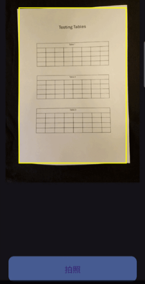
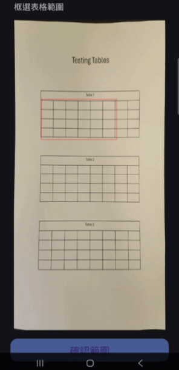
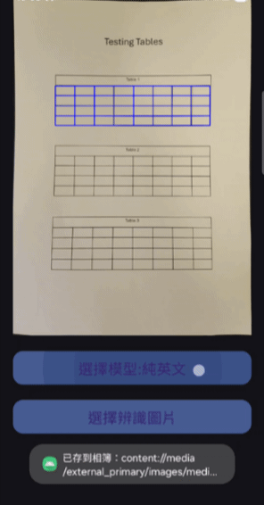
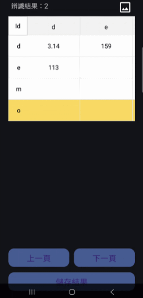
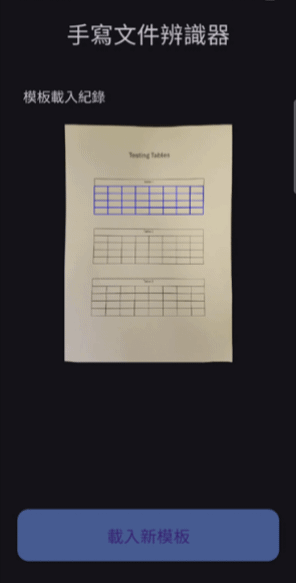

# 手寫文件辨識應用程式

本專題開發一款用於辨識手寫文件表格中的文字的行動應用程式，可框選表格範圍、切割欄位，並辨識表格內的手寫文字。系統支援離線運作、辨識結果輸出、本地歷史紀錄，適合用於資料數位化與表單管理自動化。

## 主要功能

- 本地歷史紀錄：可瀏覽、載入過去資料及刪除紀錄。
- 表格框選與切割：使用者可框選表格範圍，系統會依據選定範圍偵測與切割表格。
- 手寫文字辨識：以深度學習模型辨識手寫文字，支援純英文、純數字及英數混合三種模型。
- 結果顯示：將辨識結果顯示在表格內，使用者可以更改結果。
- 結果輸出：辨識結果可匯出為 `.csv` 或 `.xlsx` 檔案。
- 離線運作：不需網路也可以使用所有功能。

## 使用技術與主要套件

| 類別 | 套件 / 技術 |
| - | - |
| 🧩 **Android 開發** | AndroidX、Material Components |
| 🐍 **Python 整合**  | Chaquopy |
| 🧮 **影像處理** | OpenCV、YOLO |
| 🧠 **模型推論** | ONNX Runtime |
| 🧾 **表格輸出** | Apache POI、commons-collections、xmlbeans |
| 🗃️ **UI 元件** | TableView、PhotoView |
| 🔧 **JSON 處理** | Gson |

## 專題主要架構

以下為專題主要資料夾結構，包含 Java 程式邏輯、Python 模組與介面資源配置。

    
📁 assets

    包含純英文、純數字、英數混合三種類型的 .onnx 檔案。

    
📁 java

    

        
📁 activities

        包含各個主要畫面與互動流程。
    

    

        
📁 adapter

        包含首頁歷史紀錄以及結果顯示表格的適配器。
    

    

        
📁  core

        核心邏輯的資料夾，包含 Java 呼叫 Python 以及 Yolo 推論的程式。
    

    

        
📁 fragment

        以 Bottom sheet fragment 為主的資料夾。
    

    

        
📁 holder

        包含用來暫存表格畫面元件的物件以及暫存模板資訊的單一實例。
    

    

        
📁 listener

        包含表格的事件監聽器，偵測點擊事件並回呼方法。
    

    

        
📁 model

        包含歷史紀錄與表格的資料結構。
    

    

        
📁 utils

        一些小工具。包含處理輸出為 .csv 與 .xlsx 的工具，將模板圖片儲存到媒體瀏覽器及           App 內部的工具，根據 uri 取得對應圖片的工具，與處理歷史紀錄的工具。
    

    

        
📁 widget

        自訂的元件，包含拍照畫面的框框以及可拖曳矩形框框的 ImageView。
    

    
📁 python

    包含 Java 呼叫 Python 的 interface 以及 python 影像處理的程式。

    
📁 res

    

        
📁 drawable

        包含圖示、UI 元件圖。
    

    

        
📁 layout

        包含介面配置的 XML。
    

    

        
📁 minimap

        包含 App 的圖示。
    

    

        
📁 values

        包含自訂參數、顏色、字串與淺色主題的 XML。
    

    

        
📁 values-night

        包含深色主題的 XML。
    

## 開發環境

| 組件 | 版本 |
|------|-----------|
| **Android Studio** | Meerkat 2024.3.1 Patch 1 |
| **Gradle** | 8.11.1 |
| **Python** | 3.12.10 |
| **Android SDK** | 最低支援 Android 7.0 (API 24)，目標 Android 15 (API 35) |

## 主要功能畫面

|                                     拍攝模板                                      |                                      框選表格範圍                                      |
|:-----------------------------------------------------------------------------:|:--------------------------------------------------------------------------------:|
|  |  |

|                                     選擇辨識模型                                      |                                     顯示辨識結果                                     |
|:-------------------------------------------------------------------------------:|:------------------------------------------------------------------------------:|
|  |  |

|                                    匯出檔案                                    |                                     載入歷史紀錄                                      |
|:--------------------------------------------------------------------------:|:-------------------------------------------------------------------------------:|
|  |  |

## 開發資訊

國立逢甲大學 資訊工程學系

指導老師：李俊宏教授

專題成員：邱何朋、羅勖恩

## 開放原始碼授權

本專案使用多個第三方開源套件：詳見 [Open Source Licenses](https://github.com/mushrio/fcu_graduation_project/blob/master/THIRD_PARTY_LICENSES.md)